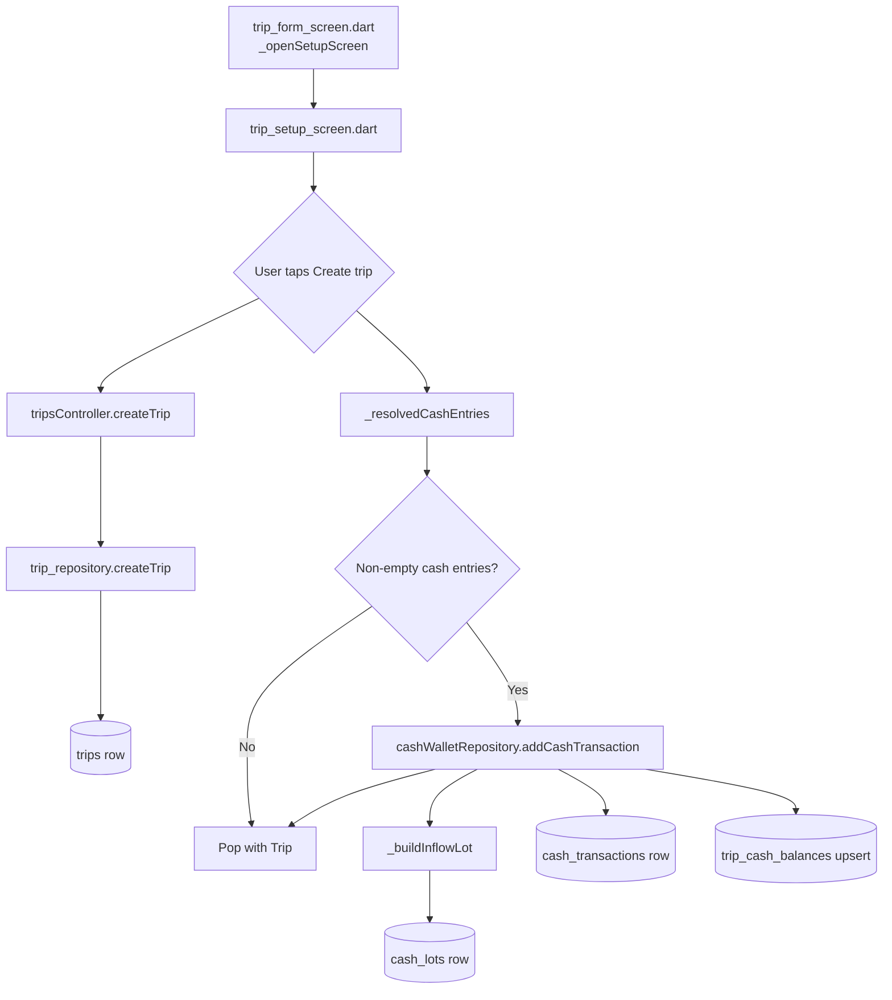

# Initial Cash Trace Report

## Executive summary

Trip Setup collects **only local cash amount and currency** for Initial Cash. It does **not** collect home-currency cost basis. The repository and database fully support cost basis, but the Trip Setup UI never passes it. For **10,000 THB** at trip creation, the system does **not** know how much SAR was paid.

**Answer to Q7: NO**

---

## Complete flow



### Step-by-step

| Step | Location | What happens |
|------|----------|--------------|
| 1 | `trip_form_screen.dart` → `_openSetupScreen()` | Navigates to `TripSetupScreen` with `selectedDestination` and optional custom title |
| 2 | `trip_setup_screen.dart` → `initState()` | Seeds one `_CashEntryRow` with destination `currencyCode` (e.g. `THB`) |
| 3 | UI | User may enter amount, change currency, add more currency rows |
| 4 | `_createTrip()` | Builds trip name, reads `homeCurrencySnapshot` from user financial profile (code only, e.g. `SAR`) |
| 5 | `tripsController.createTrip()` | Creates `Trip` domain object → `TripRepository.createTrip()` |
| 6 | `trip_repository.dart` | Inserts **1 row** into `trips` |
| 7 | `_resolvedCashEntries()` | Parses non-empty rows into `_ResolvedCashEntry { amount, currencyCode }` |
| 8 | `cashWalletRepository.addCashTransaction()` | Called **directly from UI** (no use case) with `type: initialCash`, `amount`, `currencyCode` only |
| 9 | `CashWalletRepository.addCashTransaction()` | Atomic DB transaction: insert lot → insert transaction → upsert balance |

---

## Files involved

| Layer | File | Role |
|-------|------|------|
| Navigation | `lib/features/trips/presentation/trip_form_screen.dart` | Opens Trip Setup |
| UI | `lib/features/trips/presentation/trip_setup_screen.dart` | Collects cash; orchestrates create |
| Trip controller | `lib/features/trips/presentation/trip_controller.dart` | `createTrip()` |
| Trip repo | `lib/features/trips/data/trip_repository.dart` | Persists trip |
| Trip domain | `lib/features/trips/domain/trip.dart` | `Trip` entity; `homeCurrencySnapshot` = home currency **code** |
| Provider | `lib/core/providers/database_providers.dart` | `cashWalletRepositoryProvider` |
| Cash repo | `lib/features/cash_wallet/data/cash_wallet_repository.dart` | `addCashTransaction()`, `_buildInflowLot()` |
| Cash domain | `lib/features/cash_wallet/domain/cash_transaction.dart` | `CashTransaction` |
| Cash domain | `lib/features/cash_wallet/domain/cash_lot.dart` | `CashLot` |
| Schema | `lib/core/database/app_database.dart` | `trips`, `cash_transactions`, `cash_lots`, `trip_cash_balances` |
| Contrast (post-setup) | `lib/features/cash_wallet/presentation/trip_cash_wallet_screen.dart` | Add Cash sheet **does** collect optional home value |
| Product spec | `docs/financial-conversion-model.md` | Rule 4: initial cash = amount + approximate home cost |
| Tests | `test/features/cash_wallet/data/sprint_9a_manual_cash_lot_test.dart` | Documents trip setup path as “amount + currency only” |

---

## 1. What fields does the UI collect for Initial Cash?

Per cash row (`_CashEntryRow` / `_CashRowFields`):

| Field | Collected? | Notes |
|-------|------------|-------|
| **Amount** | Yes | Local currency numeric input |
| **Currency code** | Yes | Picker; defaults to destination currency (e.g. `THB`) |

Not collected for Initial Cash in Trip Setup:

- Home currency amount
- Home currency code (as cost basis)
- Effective rate
- Note / date
- Transaction type (hardcoded to `initialCash`)

Multiple currency rows are supported via “Add currency”.

---

## 2. Does the UI collect these?

| Field | Collected? |
|-------|------------|
| `homeCurrencyAmount` | **No** |
| `homeCurrencyCode` | **No** (cost basis) |
| `effectiveRate` | **No** (would be derived) |
| Cost basis | **No** |

**Clarification:** `homeCurrencySnapshot` (e.g. `SAR`) is read from the user financial profile and stored on the **trip**, not on the cash entry. It is the trip’s home currency **code**, not “how much SAR was paid for this cash.”

```496:499:lib/features/trips/presentation/trip_setup_screen.dart
      final homeCurrencySnapshot =
          profile?.homeCurrencyCode.trim().toUpperCase().isNotEmpty == true
              ? profile!.homeCurrencyCode.trim().toUpperCase()
              : baseCurrency;
```

---

## 3. What object is passed from the UI?

No domain object is passed for cash. The flow uses:

1. Internal DTO: `_ResolvedCashEntry { amount, currencyCode }`
2. Named parameters to the repository:

```544:550:lib/features/trips/presentation/trip_setup_screen.dart
          for (final entry in cashEntries) {
            await cashWallet.addCashTransaction(
              tripId: createdTrip.id,
              type: CashTransactionType.initialCash,
              amount: entry.amount,
              currencyCode: entry.currencyCode,
            );
```

`homeCurrencyAmount`, `homeCurrencyCode`, `note`, and `createdAt` are omitted (default `null`).

---

## 4. What use case/repository receives it?

| Concern | Receiver |
|---------|----------|
| Trip creation | `TripsController` → `TripRepository` |
| Initial Cash | **`CashWalletRepository.addCashTransaction()` directly** — no use case |

There is no `RecordInitialCashUseCase`. Post-setup Add Cash uses the same repository method (or ATM/exchange use cases for those types).

---

## 5. What database rows are created?

For one Initial Cash entry of **10,000 THB** (non-zero, full create path):

### A. `trips` (1 row)

- `base_currency` / `destination_currency`: `THB`
- `home_currency_snapshot`: `SAR` (from profile, if set)
- Dates, name, destination, etc.

### B. `cash_lots` (1 row)

| Column | Value for 10,000 THB |
|--------|----------------------|
| `source_type` | `initial_cash` |
| `source_ref_type` | `cash_transaction` |
| `source_ref_id` | cash transaction UUID |
| `currency_code` | `THB` |
| `original_amount` | `10000` |
| `remaining_amount` | `10000` |
| `home_currency_amount` | **NULL** |
| `home_currency_code` | **NULL** |
| `effective_rate` | **NULL** |

### C. `cash_transactions` (1 row)

| Column | Value |
|--------|-------|
| `type` | `initial_cash` |
| `amount` | `10000` |
| `currency_code` | `THB` |
| `home_currency_amount` | **NULL** |
| `home_currency_code` | **NULL** |
| `lot_id` | linked to cash lot |

### D. `trip_cash_balances` (1 upsert)

- `trip_id` + `currency_code` = `THB`
- `balance_amount` = `10000`

All writes are atomic in one SQLite transaction (`addCashTransaction`).

---

## 6. When creating `cash_lot`, are basis fields populated?

| Column | Populated? |
|--------|------------|
| `home_currency_amount` | **No** → NULL |
| `home_currency_code` | **No** → NULL |
| `effective_rate` | **No** → NULL |

Repository logic (all-or-nothing basis):

```187:204:lib/features/cash_wallet/data/cash_wallet_repository.dart
    final normalizedHomeCode = homeCurrencyCode?.trim().toUpperCase();
    final hasBasis = homeCurrencyAmount != null &&
        homeCurrencyAmount > 0 &&
        normalizedHomeCode != null &&
        normalizedHomeCode.isNotEmpty;

    return CashLot.create(
      ...
      homeCurrencyAmount: hasBasis ? homeCurrencyAmount : null,
      homeCurrencyCode: hasBasis ? normalizedHomeCode : null,
      effectiveRate: hasBasis ? homeCurrencyAmount / amount : null,
```

With no `homeCurrencyAmount` / `homeCurrencyCode` passed from Trip Setup, `hasBasis` is false → all three basis columns stay NULL. This matches `sprint_9a_manual_cash_lot_test.dart` (“trip setup initial cash path — no cost basis collected there”).

---

## 7. User enters 10,000 THB during trip creation — does the system know how much SAR was paid?

## **NO**

The system knows:

- 10,000 THB was added as initial cash
- Trip home currency code is likely `SAR` (on `trips.home_currency_snapshot`)

It does **not** know:

- SAR amount paid for that THB
- Effective rate for that lot
- Home-currency cost basis for FIFO / reporting

---

## 8. Where the information is lost

Loss is at the **UI boundary**, not in the repository or schema.

| # | Location | What is lost |
|---|----------|--------------|
| 1 | `_CashRowFields` | Only amount + currency; no home-value field |
| 2 | `_ResolvedCashEntry` | Only `{ amount, currencyCode }`; no basis fields |
| 3 | `addCashTransaction()` call in `_createTrip()` | `homeCurrencyAmount` and `homeCurrencyCode` never passed |
| 4 | Downstream | `_buildInflowLot()` correctly creates a lot **without basis** when those params are absent |

The repository **can** persist basis when provided (see Add Cash sheet):

```1141:1148:lib/features/cash_wallet/presentation/trip_cash_wallet_screen.dart
        await ref.read(cashWalletRepositoryProvider).addCashTransaction(
              tripId: widget.trip.id,
              type: _selectedType,
              amount: validAmount,
              currencyCode: currencyCode,
              homeCurrencyAmount: homeValue,
              homeCurrencyCode: homeCurrencyCode,
```

Trip Setup does not use that path.

**Downstream impact:** `CashLotFifoEngine` leaves `homeAmount` null when `effectiveRate` is null, so cash expenses from this lot cannot derive SAR cost at spend time.

---

## 9. Classification

| Category | Applies? | Rationale |
|----------|----------|-----------|
| **Financial Core issue** | **Yes (primary)** | `docs/financial-conversion-model.md` Rule 4 requires amount + approximate home cost at initial cash. FIFO, lot summaries, and home-currency reporting depend on `effective_rate`. Trip Setup bypasses that contract. |
| Production Readiness issue | Partial | Balance tracking works; home-currency conversion for initial cash does not. |
| UX issue | **Yes (secondary)** | Inconsistent with Add Cash sheet, which offers optional “home value”. Users may assume trip-setup cash is fully tracked in home currency. |
| Not an issue | No | Gap is real and documented in tests as intentional current behavior for trip setup. |

---

## Fields collected vs persisted

| Field | UI collects | Passed to repo | `cash_transactions` | `cash_lots` |
|-------|-------------|----------------|---------------------|-------------|
| Local amount | Yes | Yes | Yes | `original_amount`, `remaining_amount` |
| Local currency | Yes | Yes | Yes | `currency_code` |
| `homeCurrencyAmount` | No | No | NULL | NULL |
| `homeCurrencyCode` (basis) | No | No | NULL | NULL |
| `effectiveRate` | No | No | N/A | NULL |
| Trip `homeCurrencySnapshot` | N/A (profile) | On trip only | N/A | N/A |

---

## Final conclusion

Trip Setup Initial Cash is a **thin cash-on-hand capture**: local amount and currency only. Persistence (lot + transaction + balance) is correct for **local balance**, but **cost basis is never captured** on this path.

For **10,000 THB** at creation, SAR paid is **unknown** unless the user later edits cash via the wallet Add Cash flow (which supports optional home value) or adds basis another way.

---

## Severity

**Medium–High** for financial accuracy and reporting; **Low** for raw THB balance tracking.

- Cash balance and spendability: OK  
- Home-currency spend estimates, pool rate, FIFO home amounts, remaining cash cost basis: **missing for trip-setup initial cash**

---

## Recommendation

1. **Align Trip Setup with product model** — Add optional “approximate home value” (same pattern as `trip_cash_wallet_screen.dart`), using `trip.homeCurrencySnapshot` as `homeCurrencyCode`.
2. **Pass basis into existing API** — Extend `_ResolvedCashEntry` and the `addCashTransaction()` call with `homeCurrencyAmount` / `homeCurrencyCode`; no repository change required.
3. **Consider a thin use case** — e.g. `RecordInitialCashUseCase`, shared by Trip Setup and Add Cash, to keep basis rules in one place.
4. **Migration / backfill** — Existing trips with basis-less initial lots cannot recover SAR paid retroactively; document that limitation or offer edit-in-wallet to add basis.

---

*Audit only — no code was modified.*